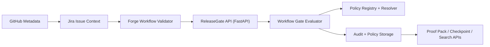
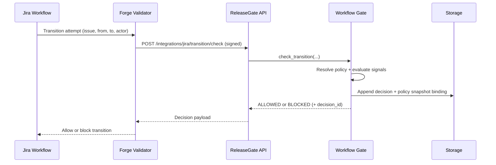
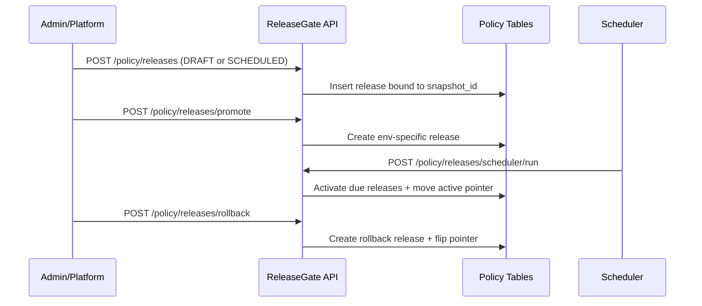

# ReleaseGate Architecture

This document describes the production architecture of ReleaseGate as a verifiable change authorization system.

## 1. System Goals

ReleaseGate is designed to provide:

- Hard transition-time authorization (`ALLOW` or `DENY`)
- Deterministic, replayable decisions
- Immutable policy binding per decision
- Staged policy rollout (dev, staging, prod)
- Audit-grade evidence and verification APIs

## 2. Pillar Model

### Pillar 1: Transition-Level Enforcement

Single authoritative gate:

```text
check_transition(issue_key, transition_id, actor, context) -> ALLOW | DENY
```

Key properties:

- Deterministic evaluation from canonical inputs
- Strict fail-closed behavior in production mode
- Decision hashing (`input_hash`, `policy_hash`, `decision_hash`, `replay_hash`)
- Immutable decision persistence

### Pillar 2: Declarative Policy Governance

Key properties:

- Declarative policy definitions (compiled, versioned, validated)
- Immutable resolved policy snapshots per decision
- Rollout control plane with releases, active pointers, scheduler, rollback
- Linting for policy safety (`AMBIGUOUS_OVERLAP`, `CONTRADICTORY_RULES`, `COVERAGE_GAP`)

## 3. High-Level Topology



## 4. Runtime Flows

### 4.1 Transition Enforcement Flow



### 4.2 Policy Rollout Flow



## 5. Core Components

### 5.1 API Layer

- File: `releasegate/server.py`
- Responsibilities:
  - AuthN/AuthZ boundary
  - Public endpoints for governance and audit
  - Policy release lifecycle endpoints
  - Decision snapshot verification endpoints

### 5.2 Workflow Gate

- File: `releasegate/integrations/jira/workflow_gate.py`
- Responsibilities:
  - Transition evaluation orchestration
  - Strict fail-closed dependency handling
  - Deterministic decision identity
  - Policy resolution and enforcement outcome

### 5.3 Policy Snapshot and Binding

- File: `releasegate/policy/snapshots.py`
- Responsibilities:
  - Build canonical resolved policy snapshots
  - Compute `policy_hash` from canonical snapshot payload
  - Persist immutable snapshots and bind decision records
  - Verify decision-to-snapshot hash integrity

### 5.4 Policy Release Control Plane

- File: `releasegate/policy/releases.py`
- Responsibilities:
  - Create releases (draft/scheduled/active)
  - Promote between environments
  - Activate due scheduled releases
  - Rollback via pointer switch

### 5.5 Linting and Safety Gates

- File: `releasegate/policy/lint.py`
- Responsibilities:
  - Detect contradictory and ambiguous policy overlap
  - Detect shadowed/unreachable rules
  - Detect required coverage gaps
  - Return machine-readable diagnostics for CI gating

## 6. Persistence Model

Primary governance tables include:

- `audit_decisions`: immutable decision records
- `policy_resolved_snapshots`: immutable canonical resolved snapshots
- `policy_decision_records`: hard binding (`decision_id` -> `snapshot_id`)
- `policy_releases`: release objects with lifecycle state
- `active_policy_pointers`: active release pointer per `(tenant, policy, env)`
- `policy_release_events`: append-only release event ledger

Migration source:

- `releasegate/storage/migrations.py`

Runtime schema bootstrap:

- `releasegate/storage/schema.py`

## 7. Invariants and Guarantees

ReleaseGate enforces the following invariants:

- Same canonical input yields deterministic decision identity
- Decisions are append-only
- Resolved policy snapshots are immutable
- Every decision binds to a persisted snapshot and verifiable hash
- Environment policy activation is pointer-based and reversible
- Scheduler activation is idempotent

## 8. Security and Trust Boundaries

### Inbound Request Security

- JWT/API key/signature authentication
- Signature nonce and skew checks for replay resistance
- Tenant-scoped authorization checks

### Operational Security

- Strict-mode fail-closed behavior for missing critical dependencies
- Rate limiting by IP and tenant
- Security audit events for privileged policy operations

## 9. API Surface (Governance-Critical)

Policy snapshot and verification:

- `GET /decisions/{decision_id}/policy-snapshot`
- `GET /decisions/{decision_id}/policy-snapshot/verify`

Policy release lifecycle:

- `POST /policy/releases`
- `POST /policy/releases/promote`
- `POST /policy/releases/{release_id}/activate`
- `POST /policy/releases/rollback`
- `POST /policy/releases/scheduler/run`
- `GET /policy/releases/active`

Audit and evidence:

- `GET /audit/search`
- `GET /audit/export`
- `GET /audit/proof-pack/{decision_id}`

## 10. CLI Control Plane

Key commands:

- `releasegate lint-policies`
- `releasegate show-decision-policy-snapshot`
- `releasegate verify-decision-policy-snapshot`
- `releasegate policy-release-create`
- `releasegate policy-release-promote`
- `releasegate policy-release-activate`
- `releasegate policy-release-active`
- `releasegate policy-release-rollback`
- `releasegate policy-release-run-scheduler`

## 11. Deployment Notes

- Backend: FastAPI (`releasegate.server:app`)
- Jira integration: Forge validator invoking transition check endpoint
- Storage: SQLite or Postgres backends with forward-only migrations
- Recommended production controls:
  - Required CI checks (tests, lint, migration checks)
  - Protected branch policy
  - Release lifecycle operations restricted to admin role

## 12. Architecture Summary

ReleaseGate combines hard real-time enforcement with immutable, staged policy governance.

That combination makes policy decisions:

- Deterministic
- Verifiable
- Auditable
- Operationally controllable across environments

