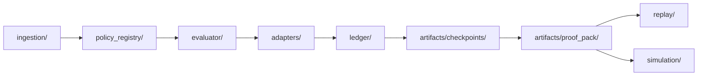

# ReleaseGate Architecture

## Module Boundary Map

| Architecture Node | Target Module Boundary | Current Implementation Mapping |
|---|---|---|
| Ingestion | `releasegate/ingestion/` | `releasegate/integrations/jira/`, provider modules |
| Policy Registry | `releasegate/policy_registry/` | `releasegate/policy/loader.py`, `releasegate/saas/policy.py` |
| Evaluator | `releasegate/evaluator/` | `releasegate/engine.py`, `releasegate/engine_core/` |
| Enforcement Adapters | `releasegate/adapters/` | `releasegate/integrations/jira/workflow_gate.py`, enforcement runner |
| Ledger | `releasegate/ledger/` | `releasegate/audit/overrides.py`, `releasegate/audit/recorder.py` |
| Checkpoints | `releasegate/artifacts/checkpoints/` | `releasegate/audit/checkpoints.py` |
| Proof Packs | `releasegate/artifacts/proof_pack/` | `releasegate/server.py` proof-pack endpoint, CLI proof-pack command |
| Replay | `releasegate/replay/` | `releasegate/replay/decision_replay.py` |
| Simulation | `releasegate/simulation/` | `releasegate/policy/simulation.py` |

## Boundary Rules

- Evaluator is pure decision logic (no external side effects).
- Adapters enforce decisions and own API/protocol translation.
- Ledger and artifact generation are append-only / read-only workflows.
- Replay and simulation operate from stored snapshots and policy bindings.
