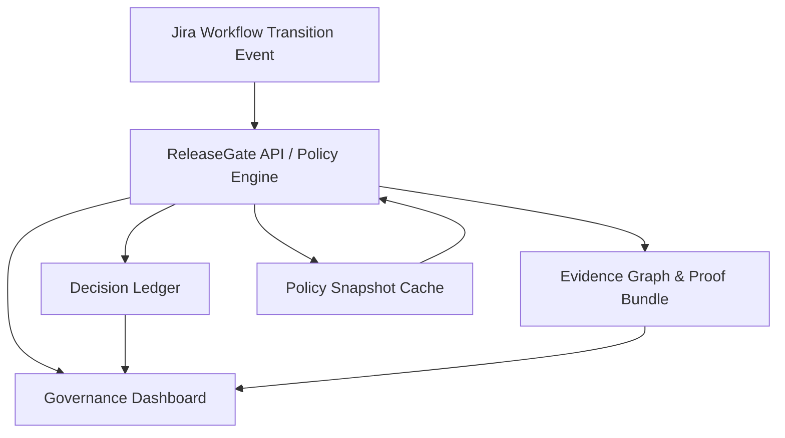

# ReleaseGate Architecture Overview

This page is a concise architecture artifact for security, procurement, and platform review workflows.

## System Diagram

## Component Responsibilities

- Jira integration: sends transition-check payloads for governed workflow movement.
- Policy engine: resolves active policy snapshot and computes deterministic allow/block decisions.
- Decision ledger: stores append-oriented decision artifacts and policy bindings.
- Evidence graph and proof bundles: expose verification artifacts for auditors and responders.
- Dashboard: operational UX for onboarding, observability, overrides, tenant admin, and billing.

## Control-Plane Characteristics

- Tenant isolation: requests are evaluated within a tenant identity boundary.
- Snapshot binding: decisions are tied to immutable policy version/hash context.
- Replayability: decision inputs/outputs can be recomputed for integrity checks.
- Failure semantics: fallback/grace behavior and fail-closed strategy are documented.

## Deployment Topology Options

ReleaseGate supports multiple deployment models:

- Docker Compose quickstart (`deploy/docker-compose`)
- Kubernetes Helm chart (`deploy/helm/releasegate`)
- Terraform AWS module (`infra/terraform/releasegate`)

## Related References

- Detailed architecture notes: `docs/architecture.md`
- Multi-region strategy: `docs/multi_region_strategy.md`
- SLA and failure modes: `docs/sla.md`, `docs/sla_failure_modes.md`
