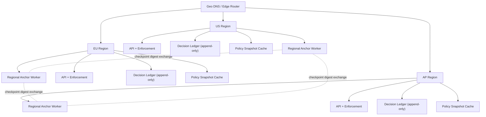

# Multi-Region & Data Residency Strategy

## Purpose

This document defines how ReleaseGate scales to multi-region operation while preserving tenant isolation, cryptographic integrity, and regional data residency requirements.

## Scope

- Architecture strategy and operational model.
- Residency and key custody guarantees.
- Failover behavior and compliance posture.
- No implementation commitment in this phase.

## Multi-Region Architecture

ReleaseGate runs as region-local active-active enforcement planes.

- Region-local components:
- API and enforcement service.
- Policy snapshot cache.
- Decision ledger.
- Anchoring worker.
- Routing:
- Geo-aware DNS or edge routing sends tenants to their assigned region.
- Tenants are pinned to a home region in normal operation.



## Ledger Replication Model

- Each region maintains an independent append-only decision ledger.
- Cross-region transfer uses signed checkpoint digests, not full raw events by default.
- Checkpoint exchange provides tamper-evidence across regions with minimal data movement.
- Regional verification jobs validate remote checkpoint continuity.

## Anchor Independence

- Each region anchors independently to avoid single-region dependency.
- Anchor pipelines and credentials are region-scoped.
- Anchor outage in one region does not block enforcement in another region.

## Region Isolation

| Layer | Isolation Rule |
| --- | --- |
| API and enforcement | Region-local runtime and storage |
| Ledger | Region-local append-only chain |
| Policy cache | Region-local cache and TTL logic |
| Anchoring | Region-local workers and credentials |

Regional outages are contained. Other regions continue operating.

## Failover Design

- Default mode: strict region pinning.
- Automatic cross-region failover is disabled by default to preserve residency.
- Emergency failover is explicit and audited.
- Emergency controls:
- Admin approval.
- Time-bound override.
- Recorded reason and actor.
- Full audit trail of start and end timestamps.

## Data Residency Model

- Each tenant has a `home_region`.
- All tenant runtime traffic is routed to that region in standard mode.
- Data-at-rest stays in-region unless explicit disaster recovery procedures are invoked.

Example tenant residency record:

```json
{
  "tenant_id": "tenant_acme",
  "home_region": "eu-west",
  "residency_enforced": true
}
```

## Encryption Boundary Separation

- Every region has an independent key hierarchy.
- Region keys never leave region custody.
- Encrypted domains include:
- Decision logs.
- Policy snapshots.
- Tenant onboarding and governance config.

## Regional Key Custody

- Per-region root key.
- Per-tenant derived key material in that region.
- Keys are non-portable across regions by policy.

Example key hierarchy:

```text
eu-west root key
  ├── tenant_acme key
  └── tenant_orion key
```

## Compliance Alignment

| Framework | Support Mechanism |
| --- | --- |
| GDPR | Tenant-region pinning, EU-local processing |
| SOC 2 | Region-scoped auditability and controls |
| ISO 27001 | Segregated key custody and operational boundaries |
| FINRA-style controls | Regional audit trails and override logging |

## Operational Rollout Model

Recommended initial regions:

- `us-east`
- `eu-west`
- `ap-southeast`

Expansion path:

- Deploy new region-local stack.
- Enable regional anchoring.
- Seed policy snapshots and config controls.
- Assign new tenants or migrate via explicit residency-approved runbook.

## Failure Mode Summary

| Scenario | Expected Behavior |
| --- | --- |
| Single-region API outage | Affected region degraded; other regions unaffected |
| Regional anchoring outage | Enforcement continues; integrity/anchor alerts raised |
| Control-plane interruption | Region uses cached policy snapshots per TTL and grace rules |
| Emergency cross-region continuity | Explicit, audited override with TTL and operator approval |

## Decision Statement

ReleaseGate is designed for region-isolated active-active enforcement with residency-first routing, independent anchoring, and region-scoped cryptographic custody. This provides a credible enterprise path to multi-region deployment without introducing global runtime coupling.
